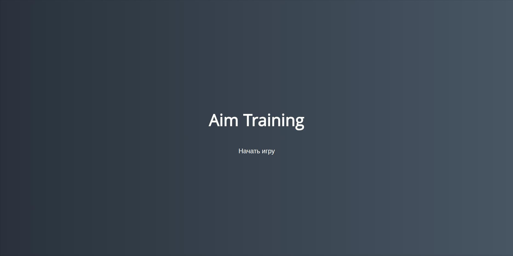
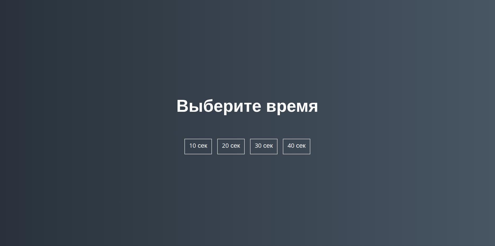
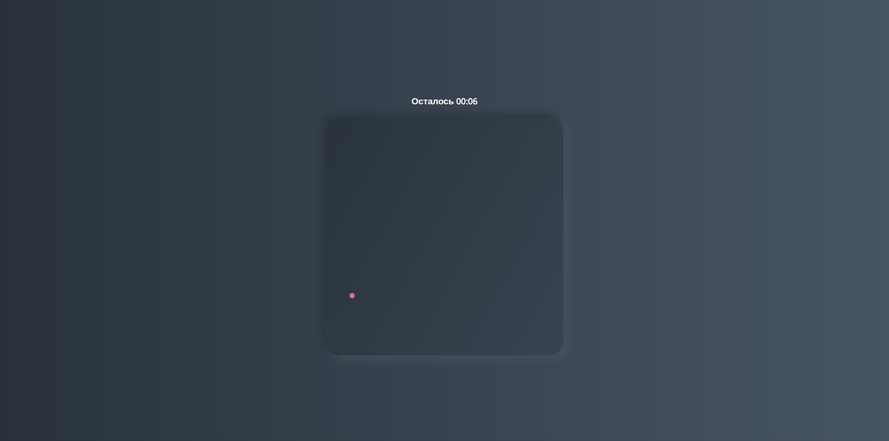

Учебный проект с марафона в стиле "повторяй как попугай за мной, может что-то запомнишь"

## Запуск игры

Игра без скачивания доступна по ссылке https://als-creator.github.io/AimTrainingGame

Чтобы запустить игру локально:

1. Клонируйте репозиторий:
   ```bash
   gh repo clone als-creator/AimTrainingGame
   ```
2. Перейдите в папку проекта:
   ```bash
   cd <название-папки>
   ```
3. Откройте файл `index.html` в любом современном браузере (Chrome, Firefox, Safari и т. д.).

# Игра «Лови круги»

Простая браузерная игра для развития реакции на JavaScript: нужно как можно быстрее кликать по появляющимся на экране цветным кругам. Чем быстрее вы реагируете, тем выше счёт!

## Как играть

1. **Старт.** Нажмите кнопку **«Start»**, чтобы начать игру.
2. **Выбор времени.** Выберите лимит времени на раунд (10, 20 или 30 секунд).
3. **Ловите круги.** Кликайте по цветным кругам, появляющимся на игровом поле. За каждый клик начисляется **1 очко**.
4. **Конец раунда.** Игра завершается, когда истекает отведённое время. На экране отображается итоговый счёт.

## Особенности игры

- **Случайные размеры кругов.** Каждый круг имеет случайный размер (от 10 до 60 px).
- **Случайное расположение.** Круги появляются в случайных местах игрового поля.
- **Разноцветные круги.** Каждый круг получает случайный цвет из заранее заданного списка.
- **Динамическое обновление.** После клика по кругу он исчезает, и сразу появляется новый — это поддерживает темп игры.
- **Обратный отсчёт.** В правом верхнем углу экрана идёт отсчёт оставшегося времени в формате `00:XX`.

## Скриншоты

| Экран старта                                                           | Выбор времени                                                      | Игровой процесс                                                          |
| ---------------------------------------------------------------------- | ------------------------------------------------------------------ | ------------------------------------------------------------------------ |
| [](screenshots/start-screen.jpg) | [](screenshots/time-level.jpg) | [](screenshots/game-process.jpg) |

## Технические детали

**Технологии:**

- HTML — структура страницы;
- CSS — визуальное оформление;
- JavaScript (ES6+) — игровая логика.

**Ключевые функции кода:**

- `startGame()` — запускает игру: запускает таймер и создаёт первый круг;
- `decreaseTime()` — каждую секунду уменьшает оставшееся время и обновляет отображение;
- `setTime(value)` — форматирует и выводит оставшееся время на экран;
- `finishGame()` — завершает игру и отображает итоговый счёт;
- `createRandomCircle()` — создаёт новый круг со случайными параметрами (размер, позиция, цвет) и добавляет его на игровое поле;
- `getRandomNumber(min, max)` — возвращает случайное целое число в заданном диапазоне;
- `getRandomColor()` — выбирает случайный цвет из массива `colors`.

**Элементы управления:**

- `#start` — кнопка старта игры;
- `.screen` — экраны интерфейса (старт, выбор времени, игра);
- `#time-list` — список кнопок для выбора времени игры;
- `#time` — отображение оставшегося времени;
- `#board` — игровое поле, где появляются круги;
- `.circle` — класс для создаваемых кругов.

## Лицензия

Проект распространяется под лицензией [GPLv2](LICENSE).

---

> **Примечание:** для корректной работы убедитесь, что все файлы проекта (HTML, CSS, JS) находятся в одной директории, а пути к ним указаны верно.
